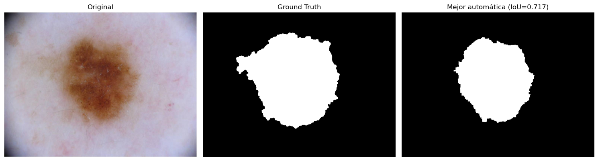
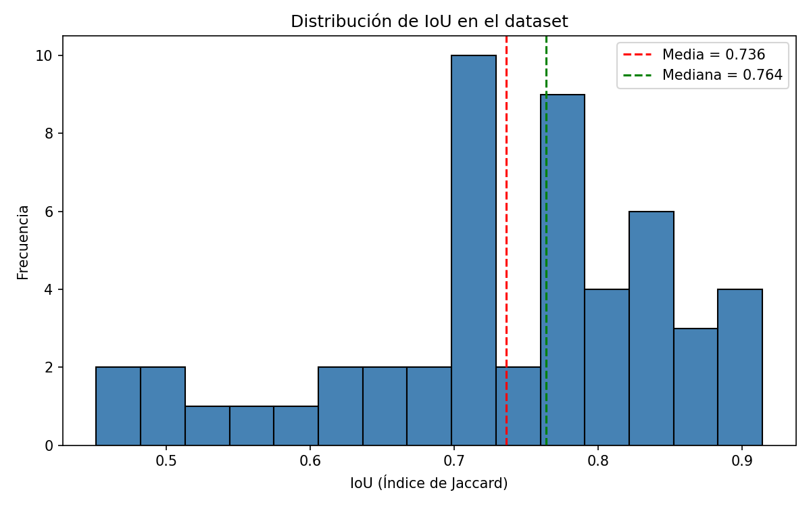

# Automated Melanoma Detection from Dermoscopic Images

Coursework project — *Análisis de Imágenes Biomédicas*, MSc in Bioinformatics
Applied to Health Sciences, Universidade da Coruña (2025/26).

A fully automatic pipeline that segments a skin lesion from a dermoscopic
photograph and classifies it as benign or melanoma, using only classical
computer vision — no deep learning, no pretrained models.

| Task | Metric | Result |
|---|---|---|
| Segmentation | Mean IoU (Jaccard index) vs. manual masks | **0.735** |
| Classification | Accuracy (SVM, RBF kernel, 5-fold CV) | **90.2%** |
| Classification | Melanoma sensitivity (recall) | **84%** |

Full methodology and discussion: [`report/Report_IEEE.pdf`](report/Report_IEEE.pdf).

## Why classical CV, not deep learning

This was an assignment for a course on classical image processing techniques
(morphology, thresholding, clustering, texture descriptors) — the constraint
was to build a working diagnostic-support pipeline *without* a CNN. The
result is a solid baseline: 90% accuracy on 51 images, but the [Limitations](#limitations)
below are exactly where a deep learning approach would help most, once more
data is available.

## Pipeline

**1. Hair removal** — dermoscopic images often have hair strands crossing
the lesion, which confuses segmentation. Multi-scale bottom-hat filtering
(5×5 and 17×17 kernels, for fine and thick hairs) detects the hair, then
Telea inpainting fills it in using the surrounding skin tone.

**2. Segmentation** — no single method works for every lesion, so four
candidates are generated per image (Otsu thresholding, direct and inverted;
K-means on the LAB color space; watershed with morphological markers), each
cleaned up with opening/closing and largest-connected-component selection.
During training, the candidate with the highest Jaccard index (IoU) against
the manual mask is kept — this ensemble-and-select strategy is why the
pipeline handles both high-contrast and poorly-lit lesions.

**3. Feature extraction (ABCDE rule)** — 40 features per lesion:
- **Shape (8)** — area, perimeter, circularity, eccentricity, elongation,
  rectangularity, dispersion, irregularity
- **Hu moments (7)** — log-transformed for numerical stability
- **Color (18)** — mean and std across BGR, HSV and LAB channels
- **Texture (7)** — Local Binary Patterns (mean, std, entropy) and
  gray-level co-occurrence matrix descriptors (contrast, energy,
  homogeneity, entropy), averaged over 4 orientations

**4. Classification** — Random Forest, SVM (RBF) and Gradient Boosting,
compared with stratified 5-fold cross-validation. SVM wins; every random
seed is fixed (`random_state=42`) so re-running the script reproduces these
numbers (bar a hundredth of a point of IoU jitter from OpenCV's K-means,
whose center initialization isn't seedable).

## Honest results

|  | Predicted benign | Predicted melanoma |
|---|---|---|
| **Actual benign** | 30 | 2 |
| **Actual melanoma** | 3 | 16 |




Segmentation IoU ranges from 0.45 to 0.91 — the weakest cases are lesions
with low contrast against the skin plus hair the bottom-hat filter didn't
fully clear. In classification, **3 melanomas were called benign** — the
clinically expensive kind of error. 84% sensitivity is a reasonable result
for 51 images and classical features, and nowhere near where a real
diagnostic aid would need to be; see below.

## Limitations

- **51 images.** Cross-validation gives an honest estimate for this
  specific set, but a model this small should not be read as a claim about
  general dermoscopic performance.
- **3 melanomas missed.** In a real triage setting a false negative here
  means a missed cancer — the sensitivity/specificity trade-off would need
  to be tuned explicitly rather than optimizing for raw accuracy.
- **Classical features cap what's learnable.** Hand-crafted descriptors
  cannot capture structures a CNN would pick up on its own; on a larger
  dataset (the full ISIC 2018 challenge has ~2,600 images) that gap would
  likely be the main lever for improvement.

## Try it live

An interactive demo is at **[marwan-melanoma-detection.streamlit.app](https://marwan-melanoma-detection.streamlit.app)**. Pick one of six
curated examples, or upload your own dermoscopic image — both paths run the
exact same pipeline. The app is upfront about what it is: an educational
demo behind a disclaimer, not a diagnostic tool, and the header repeats the
90.2% cross-validated accuracy so the number stays attached to the claim.

## Reproducing this

```bash
pip install -r requirements.txt
python data/download_dataset.py           # fetches the 51 images + masks (~15MB)
python melanoma_detector.py               # reproduces the report's numbers
python train_and_export_model.py          # fits & saves the model the app uses
streamlit run app.py                      # runs the interactive demo locally
```

`melanoma_detector.py` writes its outputs (confusion matrix, IoU histogram,
segmentation examples) to `output/`.

## Data

51 images from the [ISIC 2018 Challenge](https://challenge.isic-archive.com/)
(19 melanoma, 32 benign) — a subset selected for the course, not the full
challenge set. Not bundled in this repo (mixed licensing; see below) —
`data/download_dataset.py` fetches everything from the official ISIC Archive.

- Images and this project's code: freely usable.
- Segmentation ground truth: [CC0](https://creativecommons.org/publicdomain/zero/1.0/) (public domain) — see [`data/ATTRIBUTION_segmentation_masks.txt`](data/ATTRIBUTION_segmentation_masks.txt).
- Classification labels derive from the HAM10000 dataset, [CC BY-NC 4.0](https://creativecommons.org/licenses/by-nc/4.0/) (non-commercial) — see [`data/ATTRIBUTION_classification_labels.txt`](data/ATTRIBUTION_classification_labels.txt). `data/list.csv` (filenames + labels only, no images) is included under that license.

## Repository contents

```
melanoma_detector.py        — the full pipeline, standalone and runnable
train_and_export_model.py   — fits the final SVM on all 51 images, saves it for the app
app.py                      — Streamlit demo (examples + free upload)
data/
  list.csv                  — image IDs + benign/melanoma labels
  download_dataset.py       — fetches images + masks from the ISIC Archive
  ATTRIBUTION_*.txt          — dataset licenses
app_assets/
  model.joblib              — the trained SVM the app loads
  examples/                 — 6 curated CC0 images + masks for the demo's example mode
report/
  Report_IEEE.pdf            — full write-up: related work, method, results, discussion
figures/                     — segmentation example, confusion matrix, IoU distribution
```

---
Marwan El Saabi · MSc Bioinformatics, Universidade da Coruña
